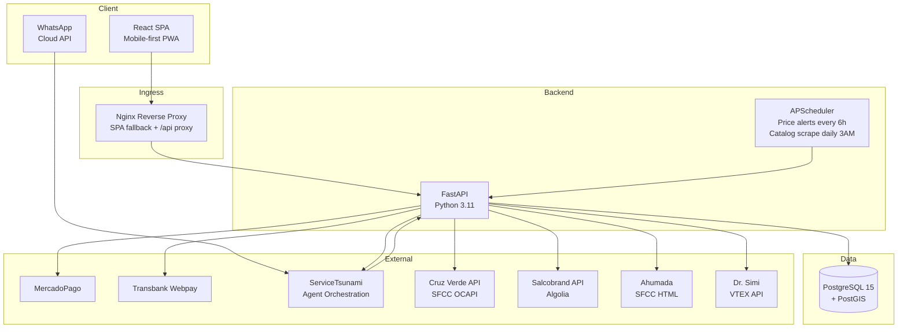
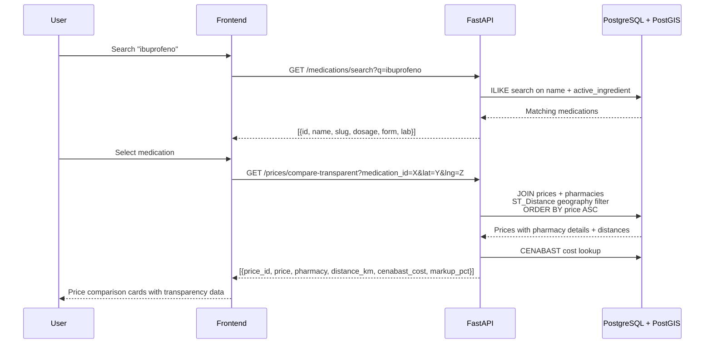
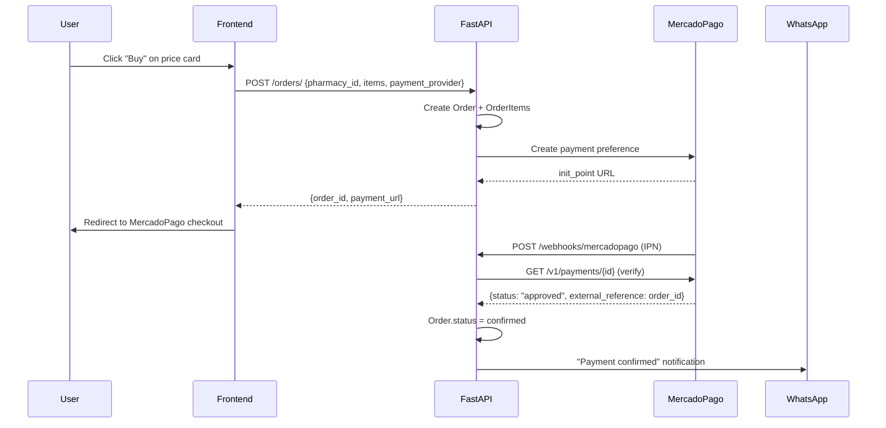
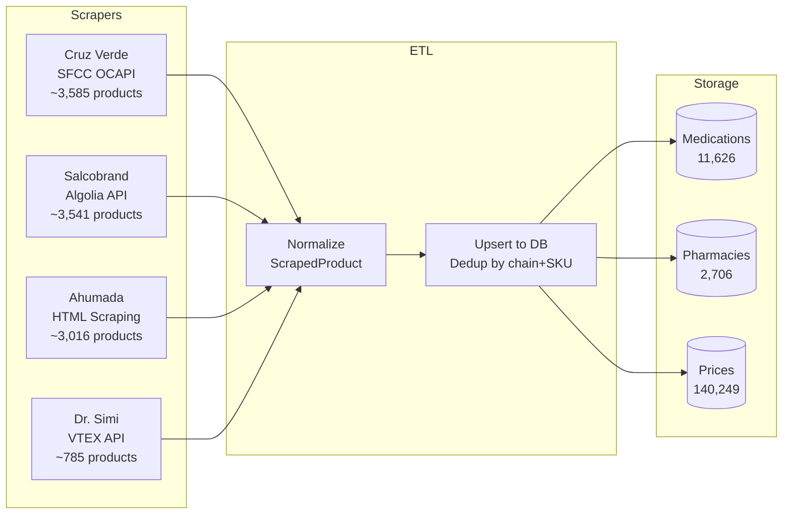
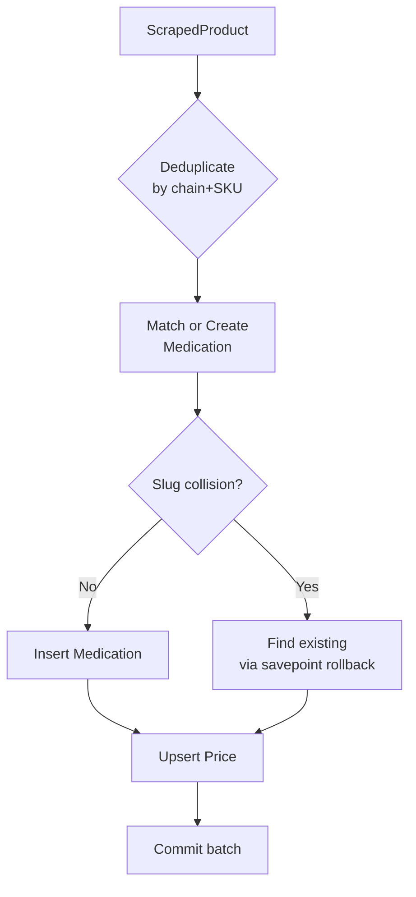
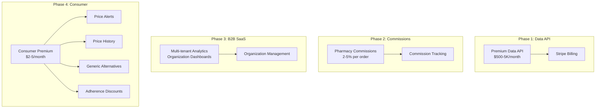

<p align="center">
  <h1 align="center">Remedia</h1>
  <p align="center">
    <strong>Chile's Medication Price Comparison Marketplace</strong>
  </p>
  <p align="center">
    Find the cheapest legal medicines near you. Compare prices across 4 pharmacy chains, 2,700+ locations, and 11,600+ medications.
  </p>
</p>

<p align="center">
  <a href="#features">Features</a> &bull;
  <a href="#architecture">Architecture</a> &bull;
  <a href="#getting-started">Getting Started</a> &bull;
  <a href="#api-reference">API Reference</a> &bull;
  <a href="#data-pipeline">Data Pipeline</a> &bull;
  <a href="#monetization">Monetization</a> &bull;
  <a href="#contributing">Contributing</a>
</p>

---

## Overview

Remedia aggregates medication pricing from Chile's major pharmacy chains (Cruz Verde, Salcobrand, Ahumada, Dr. Simi) and government data sources (ISP, CENABAST). Users can search for any medication, compare prices across pharmacies ranked by price and distance, and complete purchases through WhatsApp or web checkout with MercadoPago/Transbank.

```
11,626 medications  |  140,249 prices  |  2,706 pharmacies  |  4 chains
```

## Features

### Consumer Marketplace
- **Medication search** by name, active ingredient, or dosage
- **Price comparison** across pharmacies sorted by price and distance
- **Geolocation** with Google Maps showing nearby pharmacies with stock
- **Transparency layer** — see government procurement costs (CENABAST) alongside retail prices
- **Checkout flow** with MercadoPago and Transbank Webpay integration
- **Order tracking** with real-time status timeline
- **WhatsApp commerce** — search medications, check orders, and get payment links via chat
- **Phone auth** — OTP verification delivered via WhatsApp

### Premium Features
- **Price alerts** — get WhatsApp notifications when medication prices drop below your target
- **Price history** — track how prices change over time
- **Generic alternatives** — find cheaper equivalent medications
- **Adherence program** — loyalty discounts for consistent refills

### Data Intelligence
- **Market share analytics** across pharmacy chains
- **CENABAST procurement data** — government purchase prices and institutional spending
- **BMS data integration** — pharmaceutical market intelligence
- **Programmatic API** with tiered access (Free/Pro/Enterprise)
- **Group Purchasing (GPO)** — collective buying for institutions

---

## Architecture

### System Overview



### Data Flow: Price Comparison



### Checkout & Payment Flow



### Data Pipeline: Catalog Scraping



### Project Structure

```
pharmapp/
├── backend/                          # FastAPI + PostgreSQL/PostGIS
│   ├── app/
│   │   ├── main.py                   # App entry, scheduler startup, CORS
│   │   ├── core/                     # Config, database, security, deps
│   │   ├── models/                   # 21 SQLAlchemy models (UUID PKs, PostGIS)
│   │   ├── schemas/                  # Pydantic validation
│   │   ├── api/v1/                   # Route handlers
│   │   │   ├── auth.py               # Phone OTP authentication
│   │   │   ├── medications.py        # Search & detail
│   │   │   ├── prices.py             # Price comparison + transparency
│   │   │   ├── orders.py             # Checkout + admin management
│   │   │   ├── webhooks.py           # MercadoPago, Transbank, WhatsApp
│   │   │   ├── scraping.py           # Trigger scrapes + schedule info
│   │   │   ├── premium.py            # Alerts, price history, generics
│   │   │   ├── data.py               # Market intelligence API
│   │   │   └── billing.py            # Stripe subscription management
│   │   ├── services/                 # Business logic
│   │   │   ├── payment_service.py    # MercadoPago + Transbank
│   │   │   ├── order_service.py      # Order creation with adherence discounts
│   │   │   ├── price_engine.py       # PostGIS price comparison
│   │   │   ├── whatsapp.py           # WhatsApp message templates + purchase flow
│   │   │   ├── servicetsunami.py     # Agent orchestration client
│   │   │   └── transparency_service.py
│   │   ├── scrapers/                 # Per-chain scrapers
│   │   │   ├── base.py               # BaseScraper ABC with retry + rate limiting
│   │   │   ├── cruzverde.py          # SFCC OCAPI (JSON)
│   │   │   ├── salcobrand.py         # Algolia multi-index (JSON)
│   │   │   ├── ahumada.py            # SFCC HTML + BeautifulSoup
│   │   │   ├── drsimi.py             # VTEX Catalog API (JSON)
│   │   │   └── locations/            # Store location scrapers per chain
│   │   ├── etl/                      # Data normalization pipelines
│   │   │   ├── scrape_to_marketplace.py  # Products → Medications/Prices
│   │   │   ├── locations_to_marketplace.py
│   │   │   └── cenabast_etl.py       # Government procurement data
│   │   └── tasks/                    # Background jobs
│   │       ├── scraping.py           # Catalog + location scrape orchestration
│   │       ├── price_alerts.py       # Scheduled price alert checker
│   │       └── scheduled.py          # Daily auto-scraping
│   ├── Dockerfile
│   └── requirements.txt
├── frontend/                          # React 18 SPA (mobile-first)
│   ├── src/
│   │   ├── pages/                    # 15+ pages
│   │   │   ├── HomePage.js           # Search + featured medications
│   │   │   ├── SearchResultsPage.js  # Filtered medication list
│   │   │   ├── MedicationDetailPage.js  # Price comparison + buy
│   │   │   ├── CheckoutPage.js       # Order creation + payment
│   │   │   ├── OrderDetailPage.js    # Order status + timeline
│   │   │   └── ...
│   │   ├── components/               # Reusable UI components
│   │   ├── hooks/                    # useGeolocation, useAuth, useOrg
│   │   └── api/client.js             # Axios with JWT interceptor
│   ├── nginx.conf                    # Reverse proxy config
│   └── Dockerfile
├── docker-compose.yml                 # PostgreSQL + Backend + Frontend
└── docs/plans/                        # Design documents
```

---

## Getting Started

### Prerequisites

- [Docker](https://docs.docker.com/get-docker/) and Docker Compose
- [Node.js 16+](https://nodejs.org/) (for local frontend dev)
- [Python 3.11+](https://www.python.org/) (for local backend dev)

### Quick Start

```bash
# Clone
git clone https://github.com/nomad3/pharmapp.git
cd pharmapp

# Configure environment
cp backend/.env.example backend/.env
# Edit backend/.env with your API keys (see Environment Variables below)

# Start all services
docker-compose up --build

# Seed sample data
docker-compose exec backend python -m app.seed
```

### Access Points

| Service | URL |
|---------|-----|
| Frontend | http://localhost:3000 |
| Backend API | http://localhost:8000 |
| Swagger Docs | http://localhost:8000/docs |
| ServiceTsunami | http://localhost:8001 |

### Custom Ports

```bash
DB_PORT=5435 WEB_PORT=3002 docker-compose up --build
```

---

## API Reference

### Authentication

| Method | Endpoint | Auth | Description |
|--------|----------|------|-------------|
| POST | `/api/v1/auth/otp/request` | - | Send OTP code via WhatsApp |
| POST | `/api/v1/auth/otp/verify` | - | Verify OTP, receive JWT token |

### Marketplace

| Method | Endpoint | Auth | Description |
|--------|----------|------|-------------|
| GET | `/api/v1/medications/` | - | List medications (paginated) |
| GET | `/api/v1/medications/search?q=` | - | Search by name or active ingredient |
| GET | `/api/v1/medications/{slug}` | - | Medication detail by slug |
| GET | `/api/v1/pharmacies/nearby?lat=&lng=&radius_km=` | - | Nearby pharmacies (PostGIS) |
| GET | `/api/v1/prices/compare?medication_id=&lat=&lng=` | - | Price comparison |
| GET | `/api/v1/prices/compare-transparent?medication_id=&lat=&lng=` | - | Prices + CENABAST markup data |

### Orders

| Method | Endpoint | Auth | Description |
|--------|----------|------|-------------|
| POST | `/api/v1/orders/` | JWT | Create order + payment URL |
| GET | `/api/v1/orders/` | JWT | List user's orders |
| GET | `/api/v1/orders/{id}` | JWT | Order detail with items |
| PATCH | `/api/v1/orders/{id}/status` | Admin | Update order status |
| GET | `/api/v1/orders/admin/all` | Admin | List all orders (filterable) |

### Payment Webhooks

| Method | Endpoint | Description |
|--------|----------|-------------|
| POST | `/api/v1/webhooks/mercadopago` | MercadoPago IPN (verifies via API) |
| POST | `/api/v1/webhooks/transbank` | Transbank return URL (redirects to frontend) |
| POST | `/api/v1/webhooks/whatsapp` | Incoming WhatsApp messages |

### Scraping & Schedule

| Method | Endpoint | Description |
|--------|----------|-------------|
| POST | `/api/v1/scraping/run` | Trigger query-based scrape |
| POST | `/api/v1/scraping/catalog` | Trigger full catalog scrape |
| POST | `/api/v1/scraping/locations` | Trigger location scrape |
| GET | `/api/v1/scraping/runs` | List scrape run history |
| GET | `/api/v1/scraping/schedule` | Scheduled job info |

### Premium & Consumer

| Method | Endpoint | Auth | Description |
|--------|----------|------|-------------|
| GET | `/api/v1/premium/status` | JWT | Subscription status |
| POST | `/api/v1/premium/alerts` | JWT | Create price alert |
| GET | `/api/v1/premium/price-history/{id}` | JWT+Premium | Price history chart data |
| GET | `/api/v1/premium/generics/{id}` | JWT+Premium | Generic alternatives |
| GET/POST/DELETE | `/api/v1/favorites/` | JWT | User favorites |
| GET | `/api/v1/search-history/` | JWT | Search history |

### Data Intelligence API

```bash
# Authenticate with API key
curl -H "X-API-Key: pa_live_xxx" localhost:8000/api/v1/data/prices
```

| Method | Endpoint | Auth | Description |
|--------|----------|------|-------------|
| GET | `/api/v1/data/prices` | API Key | Medication prices |
| GET | `/api/v1/data/market-share` | API Key | Market share analytics |
| GET | `/api/v1/data/procurement` | API Key | Government procurement data |
| GET | `/api/v1/data/trends` | API Key | Sales trends |
| GET | `/api/v1/data/regions` | API Key | Regional distribution |
| POST | `/api/v1/data/export` | API Key | CSV export |

Rate limits: Free (100/day), Pro (10K/day), Enterprise (unlimited).

---

## Data Pipeline

### Pharmacy Chain APIs

| Chain | Type | API | Products | Page Size |
|-------|------|-----|----------|-----------|
| Cruz Verde | JSON | SFCC OCAPI `product_search` | ~3,585 | 200 |
| Salcobrand | JSON | Algolia multi-index `/1/indexes/*/queries` | ~3,541 | 50 |
| Ahumada | HTML | SFCC `Search-UpdateGrid` + BeautifulSoup | ~3,016 | 24 |
| Dr. Simi | JSON | VTEX `products/search?fq=C:7` | ~785 | 50 |

### Scraping Modes

1. **Query-based** (`POST /scraping/run`) — searches by active ingredient names (~200 queries per chain)
2. **Catalog browse** (`POST /scraping/catalog`) — paginates through entire "Medicamentos" category
3. **Location scrape** (`POST /scraping/locations`) — scrapes physical store addresses and coordinates

### Scheduled Jobs

| Job | Schedule | Description |
|-----|----------|-------------|
| Catalog scrape | Daily at 3:00 AM UTC | Full catalog refresh for all 4 chains |
| Price alerts | Every 6 hours | Check active alerts, notify via WhatsApp |

### ETL Process



### Government Data Sources

- **ISP** (Instituto de Salud Publica) — Drug registry and bioequivalence data
- **CENABAST** — Government procurement prices, institutional spending by product
- **BMS** — Pharmaceutical market data (sell-in/sell-out)

---

## Monetization



| Phase | Revenue Stream | Model |
|-------|---------------|-------|
| 1 | **Premium Data API** | API key auth + Stripe billing ($500-5K/mo) |
| 2 | **Pharmacy Commissions** | 2-5% per confirmed order |
| 3 | **B2B Analytics SaaS** | Multi-tenant dashboards for pharma companies |
| 4 | **Consumer Freemium** | Price alerts, history, generics, adherence ($2-5/mo) |

---

## WhatsApp Commerce

Remedia supports a conversational commerce flow via WhatsApp through [ServiceTsunami](https://github.com/nomad3/servicetsunami-agents):

| Command | Action |
|---------|--------|
| `buscar paracetamol` | Search medications and show cheapest options |
| `precio ibuprofeno` | Price lookup across all chains |
| `orden` | Check latest order status |

### Integration Points

- **OTP Delivery** — Verification codes sent via WhatsApp
- **Order Notifications** — Payment confirmed, delivering, delivered
- **Price Alerts** — Automatic notifications when prices drop
- **Refill Reminders** — Adherence program notifications
- **Conversational Search** — Natural language medication queries

---

## Tech Stack

| Layer | Technology |
|-------|-----------|
| Frontend | React 18, React Router, Recharts, Google Maps, Helmet |
| Backend | FastAPI (Python 3.11), SQLAlchemy, Pydantic |
| Database | PostgreSQL 15 + PostGIS (geography columns, spatial queries) |
| Payments | MercadoPago SDK, Transbank Webpay Plus, Stripe |
| Scraping | httpx (async), BeautifulSoup4, Algolia client |
| Scheduling | APScheduler (AsyncIOScheduler) |
| Orchestration | ServiceTsunami (AI agents, WhatsApp, pipelines) |
| Infrastructure | Docker Compose (3 services) |
| Auth | JWT + Phone OTP via WhatsApp |

---

## Environment Variables

```bash
# Core
DATABASE_URL=postgresql://postgres:postgres@db:5432/pharmapp
SECRET_KEY=your-secret-key

# URLs
BACKEND_PUBLIC_URL=http://localhost:8000     # For webhook notifications
FRONTEND_URL=http://localhost:3000           # For payment redirects

# ServiceTsunami (WhatsApp + Agent Orchestration)
SERVICETSUNAMI_API_URL=http://localhost:8001
SERVICETSUNAMI_EMAIL=
SERVICETSUNAMI_PASSWORD=
SERVICETSUNAMI_AGENT_ID=

# Payments
MERCADOPAGO_ACCESS_TOKEN=               # TEST-xxx for sandbox
TRANSBANK_COMMERCE_CODE=
TRANSBANK_API_KEY=
GOOGLE_MAPS_API_KEY=

# Stripe (B2B/Premium billing)
STRIPE_SECRET_KEY=
STRIPE_WEBHOOK_SECRET=
STRIPE_PRICE_ID_PRO=
STRIPE_PRICE_ID_ENTERPRISE=
STRIPE_PRICE_ID_PREMIUM=
```

---

## Contributing

1. Fork the repository
2. Create your branch: `git checkout -b feature/your-feature`
3. Commit your changes: `git commit -m "Add your feature"`
4. Push to the branch: `git push origin feature/your-feature`
5. Open a Pull Request

## License

MIT — see [LICENSE](LICENSE) for details.
